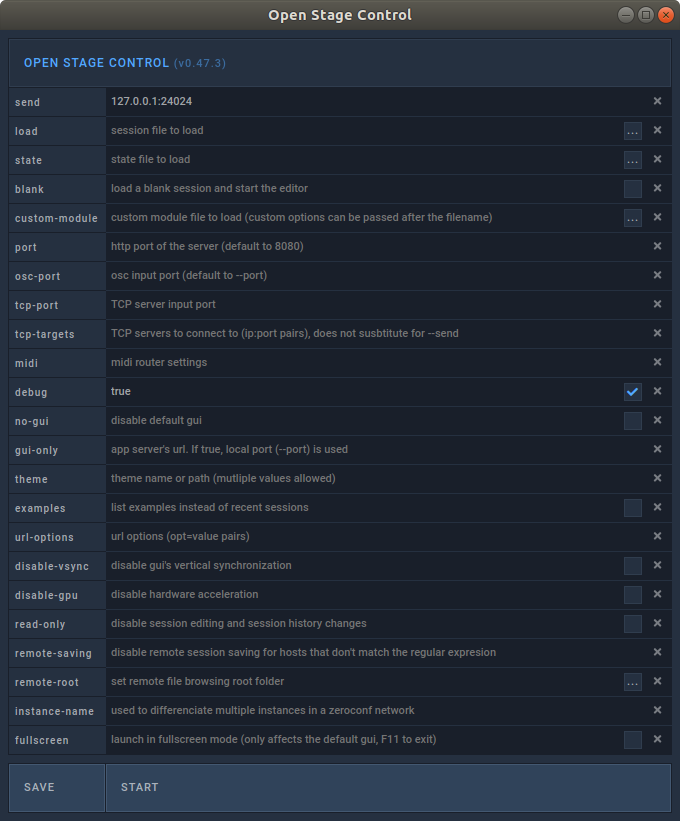

# Examples Overview

Since Elk Audio OS v1.0 all the examples are bundled with sushi and can be downloaded from the [public sushi repository](https://github.com/elk-audio/sushi).
Examples can be found under the `misc/config_files` folder.

Not all the examples will work for a specific board since they may need some extra audio channel or CV input but they are really good in showing all of the sushi features.

Some of the examples that are fully working on the Raspberry Pi are already provided in the target filesystem under `/home/mind/config_files` so they are immediately available for testing.

Here is a commented list of some of the notable examples:

  * `empty.json` : the simplest possible configuration without any plugins, Sushi will be bypassing
    the audio input to the output
  * `multichannel_plugin.json` : another audio bypass example, but this time with a multichannel
    routing between inputs and outputs
  * `fx.json` : shows how to instantiate a simple plugin FX chain on a single track
  * `prepost_tracks.json` : makes use of the "pre" and "post" tracks to add plugins before/after
    they are processed by the tracks
  * `send_return_seq.json` : shows the send/return plugins to transfer audio between tracks
  * `freeverb_aux.json` : shows how to use send/return to make an aux bus
  * `play_wav_streamer.json` : shows how to use the integrated audio file player
  * `play_brickworks_fx.json` : a single big track with all the Brickworks plugins instantiated, set
    in bypass mode so you can turn them on individually
  * `play_arp_mda_link.json` : shows the internal arpeggiator and how to sync tempo to Ableton Link

## GUI control app

The simplest way to interact at runtime with Sushi, e.g. for changing some parameters of a running
plugin, is to use the [example Python QT GUI application](https://github.com/elk-audio/sushi-gui).

If you are under macOS, just grab the latest binary from the Releases section, otherwise follow the
instructions in the [main README](https://github.com/elk-audio/sushi-gui/README.md) on how to run
from source if you're running under Linux.

.. figure:: ./illustrations/sushigui.png
   :alt: img

The usage of the GUI should be pretty straightforward: if you have a local instance of Sushi running
and listening on the default port 51051 for gRPC, the application will simply autoconnect to the
engine and populate the GUI with a widget for every track / plugin currently running.

If you want instead to control a remote instance of Sushi, you can change the IP address from the
top-level bar and connect to it.

It is possible to add new plugins and tracks while the engine is running, or remove existing ones.
You can even save the current state in binary format and later recall it through the File menu
"Save" and "Load" features.

# Control a plugin parameters with Open Sound Control (OSC)

If you want to do more on your synthesizer instance, e.g. changing some run-time parameters, SUSHI exposes everything that you need using both OSC or gRPC APIs.

Using the gRPC API gives you the greater flexibility and performance but as that is it's a more of advanced topic, it’s covered in a [dedicated section](sushi_control_grpc.md).

For OSC, we've prepared some configuration files that can be used with popular applications in our [elk-examples repository](https://github.com/elk-audio/elk-examples/tree/master/mda-jx10-vst3).

### Control MDA JX10 VST3 plugin with Open Stage Control

If you do not know what Open Sound Control (OSC) is, it is helpful (but not mandatory) [if you first read the article on the Elk Tech blog, dedicated to the topic](https://elk.audio/controlling-plug-ins-in-elk-part-i/).

1. Download and install the free [Open Stage Control](https://openstagecontrol.ammd.net/) application to your computer.

2. Upon starting it, you will see the screen below. Here, all you need to do, is enter the IP and Port number, as is displayed under 'send' below. If you run the software on the same computer as you run Sushi, the IP should remain 127.0.0.1, and if you have not changed the Sushi default configuration, Sushi's Port should remain 24024.

   
​

   3. Click Start, and subsequently 'Browse...', to navigate to the path where "mda_jx10_vst3_open_stage_control_gui.json" is available.
   4. You will now see the GUI below for controlling the jx10 synthesizer:

​

5. Assuming everything is correctly configured, the controls on the screen will send OSC messages to to the jx10 synth via Sushi, altering its parameters.

For example, dragging the knob 'Resonance', will send the point value of the knob to the OSC address  '/parameter/jx10/VCF_Reso'.

'jx10' is here the name given the plugin in the Sushi configuration file.

**Note:** If you choose to change that name ('jx10'), the Open Stage Control template is easily updated by enabling editing, clicking on the "JX-10 ELK CONTROLLER"-title, and then, in the 'osc'-section of the editor, setting the 'address' field to "/parameter/your_synth_name", instead of the current "/parameter/jx10".

### Control MDA JX10 VST3 plugin with TouchOSC

If you would prefer to control your plugin from an iPad/Android tablet, we have also created an example GUI using the
 [TouchOSC software](https://hexler.net/touchosc) - the file named *mda-vst3-touchosc-gui.touchosc*.

To use it, please refer to the TouchOSC manual - the only customisation needed is setting the IP-address that your computer running Sushi is using, in your TouchOSC app's settings.

Which OSC messages your particular configuration responds to, can be accessed by running Sushi with the *--dump
-plugins* flag, as detailed in our [detailed documentation for Sushi](sushi_overview.md).

Parameter values are in Sushi normalized to the range 0.0-1.0, floating point, across plugins and formats.

